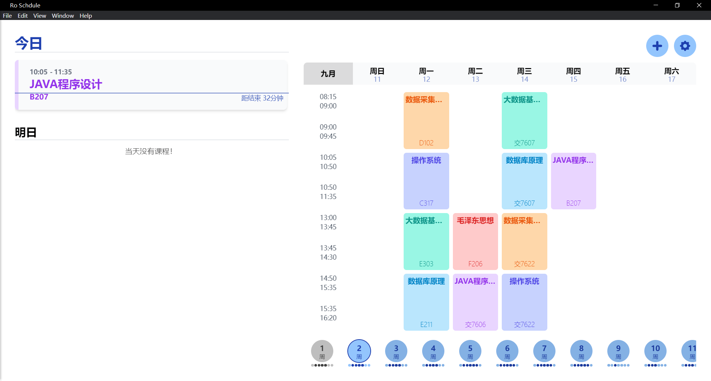

# Ro Schedule

## 项目介绍

Ro Schedule 是基于 Vue3 + Electron 开发的课程表程序。




## 特性

-   基于 Vue3 开发
-   支持多语言
-   支持主题色切换
-   支持上下课课程提醒

## 部署

1. 克隆本仓库
2. 安装依赖
```
yarn install
```
3. 编译打包
```
yarn run build
```
